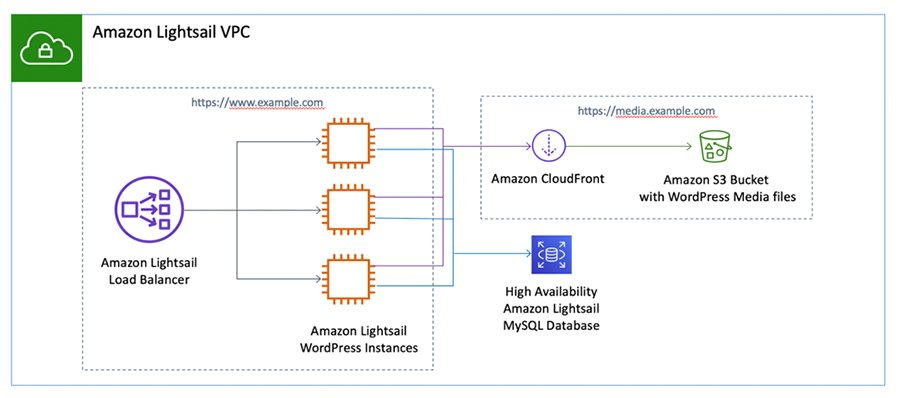
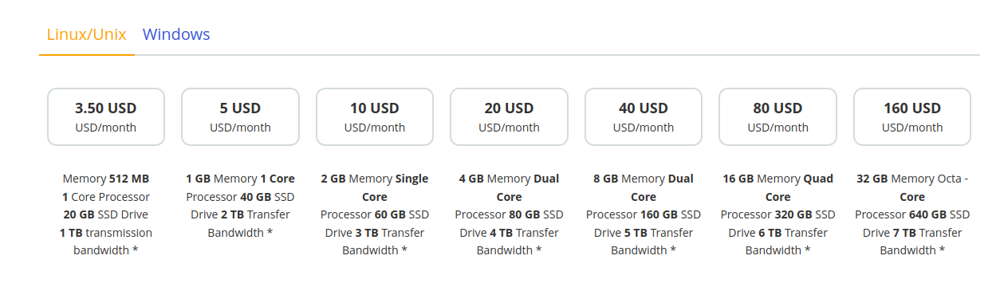
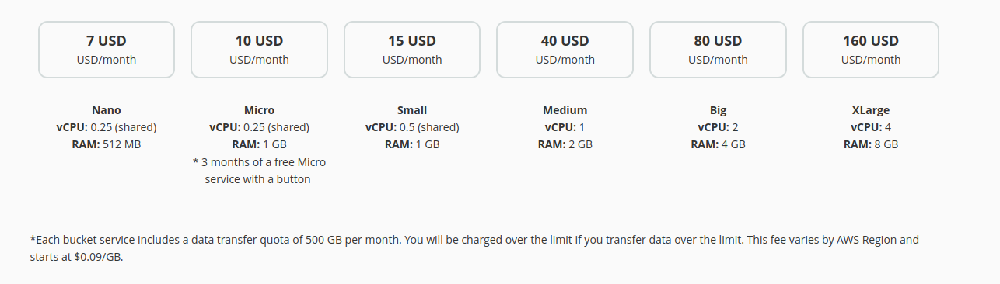
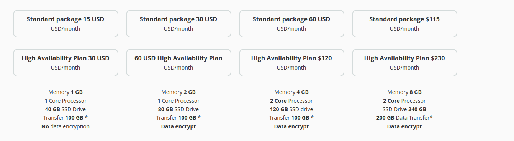
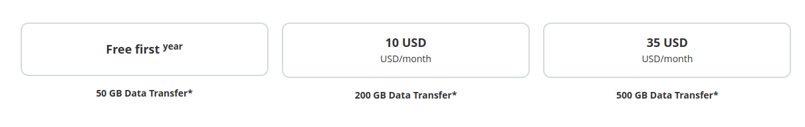
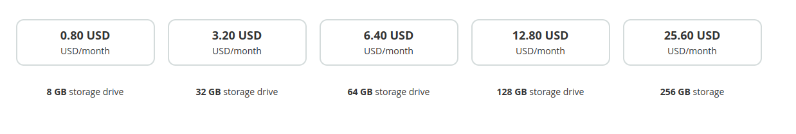
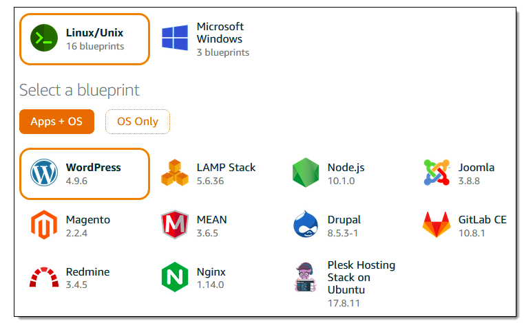
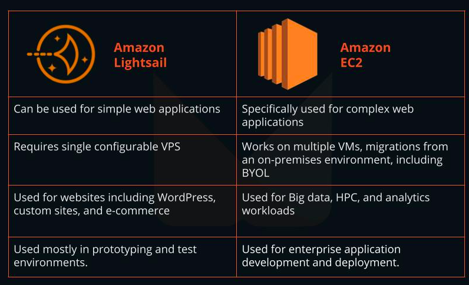

# LIGHTSAIL AWS
## <a name='TableofContents'></a>Table of Contents
<!-- vscode-markdown-toc -->
* [ 1. Lightsail overview](#Lightsailoverview)
    * [What is Lightsail?](#WhatisLightsail)
    * [Lightsail pricing](#Lightsailpricing)
    * [Lightsail use cases](#Lightsailusecases)
	* [what is VPS](#whatisVPS)
    * [What is difference between VPS and EC2?](#WhatisdifferencebetweenVPSandEC2)
	* [a. Manual setup WordPress on Amazon Lightsail](#c.ManualsetupWordPressonAmazonLightsail)
* [2. Amazon Lightsail features](#Lightsailfeatures)
    * [Container](#Container)
    * [Database](#database)
    * [Networking](#Networking)
    * [Storage](#Storage)
    * [Domian & DNS](#domian&dns)
    * [Snapshots](#Snapshots) 
* [3. Deploy Wordpress](#)
<!-- vscode-markdown-toc-config
	numbering=false
	autoSave=true
	/vscode-markdown-toc-config -->
<!-- /vscode-markdown-toc -->
 **Lightsail Overview**


## <a name='Lightsailoverview'></a>Lightsail overview
### <a name='WhatisLightsail'></a>What is Lightsail?
- Amazon Lightsail is the easiest way to get started with AWS if you just need virtual private servers. Lightsail includes everything you need to launch your project quickly – a virtual machine, SSD-based storage, data transfer, DNS management, and a static IP – for a low, predictable price. You manage those Lightsail servers through the Lightsail console or by using the API or command-line interface (CLI).
### <a name='AmazonLightsailfeatures'></a>Amazon Lightsail features
### <a name='AmazonLightsailprice'></a>Amazone Lightsail pricing?
You pay a reasonable, dependable price when using Amazon Lightsail. Lightsail combines resources such as RAM, vCPU, as well as solid-state drive (SSD) storage into a single plan, making budgeting simple and straightforward.


Object Storage

Data Exceeded - Applies to each region separately
 ```bash
         US East(Northern Virginia)	US East(Ohio) American West(Oregon)	Canada(Central)	Europe(Frankfurt) Europe(Ireland) Europe(London) E urope(Paris)	
Storage	 $0.023/GB                  $0.023/GB	  $0.023/GB	            $0.025/GB	    $0.025/GB	        $0.023/GB	    $0.024/GB	    $0.024/GB	

Data   	 $0.09/GB	                $0.09/GB	  $0.09/GB	            $0.09/GB	    $0.09/GB	        $0.09/GB	    $0.09/GB	    $0.09/GB	
transmission  
```
#### Managed databases

#### Distribution of CDN

#### Load balancing
No need to monitor bandwidth or connection. Lightsail's load balancer has one price per month: 18 USD
USD/month
#### Data block storage


**Note**: Each set of services includes a data transfer quota of 500 GB per month. You will be charged over the limit if the data transfer exceeds the limit. These fees vary by AWS Region and start at $0.09/GB
Link reference: https://aws.amazon.com/lightsail/pricing/
## <a name='Lightsailusecase'></a>Lightsail use cases
#### Amazon Lightsail can be used for:
- Launching simple web applications – To get online quickly and easily, use pre-configured development stacks such as LAMP, Nginx, MEAN, and Node.js.
- Building small business applications – launching business-specific applications for backups, financial and accounting, information storage, sharing, and more.
- Create custom websites – With pre-configured software such as WordPress, Magento, Prestashop, and Joomla, you can create and customize your blog, e-commerce, or website in just a few clicks.
- Spin up test environments – You can try out new ideas risk-free by creating and deleting simple development sandboxes and test environments.

## <a name='whatisVPS'></a>what is VPS?

1. A virtual private server (VPS) is a virtual machine (VM) that runs its own copy of an operating system (OS), and customers may have superuser-level access to that operating system instance, so they can install almost any software that runs on that OS. For many purposes, they are functionally equivalent to a dedicated physical server, and being software-defined, are able to be much more easily created and configured. They are priced much lower than an equivalent physical server, but as they share the underlying physical hardware with other VPSs, performance may be lower, and may depend on the workload of other instances on the same hardware node.
2. type of VPS: Managed VPS and Unmanaged VPS
- Managed VPS: It allows its clients to worry much about "what" rather than "how" of managing the resources required in a full-scaled front-end application. This VPS can come along with AWS to manage the abstract laying infrastructure needed for a job or set of tasks a user wants to execute on VPS.S
- Unmanaged VPS: This allows the VPS to carry out a simple hosting experience where the client is responsible for managing all the tasks like configuring it, installing and updating the software.
## <a name='WhatisdifferencebetweenVPSandEC2?'></a>What is difference between VPS and EC2?

- WordPress on Amazon Lightsail
!(/home/vmo/Pictures/vps.png)
- When create a new VPS we also check metric, Storage, Networking, Snapshots, Backups, and Monitoring   
- ssh to VPS using ssh key pair like EC2
**Amazon Lightsail features**
## <a name='Container'></a>Container
The Lightsail Container Service allows users to run containerized applications in the cloud and access them from the internet. One example is a Python web app.

### Container services in Amazon Lightsail
Amazon Lightsail supports the following container services:
- Amazon Lightsail Container Service - Amazon Lightsail Container Service is a managed container service that allows you to run containerized applications on Amazon Lightsail. You can use Lightsail Container Service to deploy your containerized applications on Lightsail virtual private servers (instances) and manage them using Lightsail resources such as load balancers, DNS zones, and static IPs.
!(/home/vmo/Pictures/container_lightsail.png)
#### Deploy a containerized application on Lightsail

### using amazone lightsail with other aws services
- Virtual Private Cloud (VPC) - You can connect your Lightsail VPC to your Amazon VPC using VPC peering. This allows you to connect your Lightsail resources to other AWS services that are available in your Amazon VPC.
- Amazone EC2 - You can connect your Lightsail VPC to your Amazon VPC using VPC peering. This allows you to connect your Lightsail resources to other AWS services that are available in your Amazon VPC.
- Serverless computing 
- Databases - You can connect your Lightsail VPC to your Amazon VPC using VPC peering. This allows you to connect your Lightsail resources to other AWS services that are available in your Amazon VPC: Amazon DynamoDB, Amazon RDS, Amazon Aurora
- Load balancers - You can connect your Lightsail VPC to your Amazon VPC using VPC peering. This allows you to connect your Lightsail resources to other AWS services that are available in your Amazon VPC: Elastic Load Balancing, Application Load Balancer, Network Load Balancer, Classic Load Balancer
- Amazon S3 - You can connect your Lightsail VPC to your Amazon VPC using VPC peering. This allows you to connect your Lightsail resources to other AWS services that are available in your Amazon VPC: Amazon S3
- ...


2. Create a VPS (document to preference: https://lightsail.aws.amazon.com/ls/docs/en_us/articles/amazon-lightsail-quick-start-guide-wordpress)